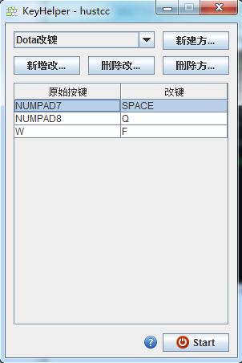

# KeyHelper

> 基于 Java Swing 的一款键盘改键程序，初衷是用于 Dota 物品和英雄技能改键，**但是实际上可以用于任何需要改键的地方**。

目前使用了 windows 平台上的 jintellitype 库，利用 jni 的方式获得系统的全局按键信息。

## 运行 & 开发

1. Runnable jar

	直接下载 **KeyHelper.jar** 文件，然后双击运行即可，前提是电脑上有 jre 环境，兼容行不知道，建议 1.6 及以上。

2. clone 项目运行

	将项目 clone 下来，然后将 dom4j 加入到 classpath，不知道是用新版本的 dom4j 会不会有问题（或者 dom4j 几年都没有更新了，好久不写 Java 了，当年毕业的时候想着一定要找一个写 Java 的公司工作）。

	然后运行 cc.hust.keyhelper.frame 包下的 **MainFrame.java 文件**即可启动。

## 截图示例

----

Updated at 2017-03-07 by [hustcc](https://github.com/hustcc). 

今天突然在项目中找到这个代码，是用来 Dota 改键的，好怀念以前打 Dota 的时候。

这个项目是四五年前，那个时候刚开始打 Dota（我是后来才打的，错过了打逗她的最好时机），那个时候是 Dota1，当时的改键工具非常多，还集合着一些外挂程序，乱七八糟，所以就自己做了一个，**专注于改键**。

今天找出来这个代码之后，修改了 README 文件，修改了代码文件中的一些老网址（几年前的博客，泪汪汪），添加了一些 gitignore，然后就发上来了，当时学了一段时间的 Java 了，代码写的依然不怎么样。

